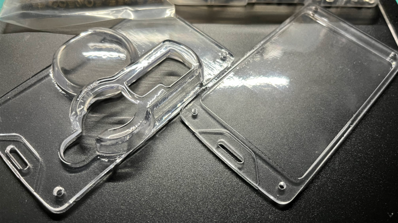

## ID case
- You can carry the following in one place
  - ID card the size of a standard credit card
  - Commercially available security token
  - Airtag

## Construction
- After placing the ID card in the hollow of the `under_*.stl`, cover the `over_*.stl` with the security token and Airtag, and fix the four corners with screws.

## File Structure
### `under_*.stl`
- `under_hole_2_5.stl`
  - Version with 2.5mm diameter screw holes at 4 corners. Use it when you want to do threading, for example.
- `under_hole_3_0.stl`.
  - Version with 3.0mm diameter screw holes at 4 corners. Use it when you want to pass a bolt straight through, for example.
- `under_hole_4_5.stl`
  - Version with 3.0mm diameter screw holes at 4 corners. Use it when using insert nuts.
### `over_*.stl`
- `over.stl`
  - Versions that can store security tokens and Airtag.
- `over_only_security_token.stl`
  - Version that can only store security tokens.
